# 911-Calls-Capstone-Project

## Overview

For this capstone project I analyzed 911 call data from a Kaggle data set leveraging the NumPy, Pandas, Matplotlib, and Seaborn libraries. I found that the zip code 19401 had the most 911 calls with 6979 reported calls, while Lower Merion had the highest 911 calls of all townships with 8443 calls. Furthermore I created visualizations to understand the reasons/departments for a 911 call, and the most popular days of the week and months of the year with average 911 calls. Below are my results.

The data contains the following fields:

* lat : String variable, Latitude *
* lng: String variable, Longitude
desc: String variable, Description of the Emergency Call
zip: String variable, Zipcode
title: String variable, Title
timeStamp: String variable, YYYY-MM-DD HH:MM:SS
twp: String variable, Township
addr: String variable, Address
e: String variable, Dummy variable (always 1)

### Calls by Department
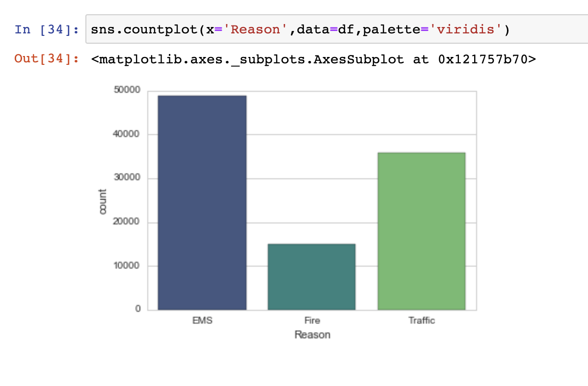

I ran a simple lambda function to create a new column splitting the title of the reason. In doing so, I found that the three reasons for 911 calls were to contact EMS (48877 calls), the Traffic department (35695 calls), and the Fire department (14920 calls).

### Calls by Day of the Week
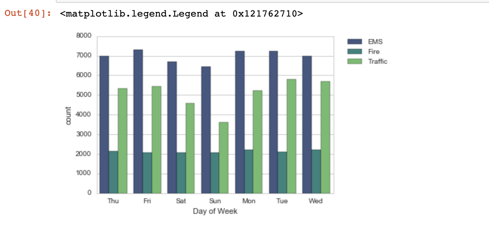

Next I aggreagated my data to focus on the day of the week from 2015 to 2020 to analyze trends. The bar chart above visualizes that EMS 911 calls occur the most on Fridays with around 7,500 calls, and the least on Sundays with around 6,500 calls. Similarly traffic 911 calls occur the least on Sundays with around 3,500 calls, but the most 911 calls fall on Tuesday with around 6900 calls. However fire 911 calls are around the same number of calls regardless of the day of the week, hovering around 2100 calls per day of the week.

### Calls by Month over the Past Year
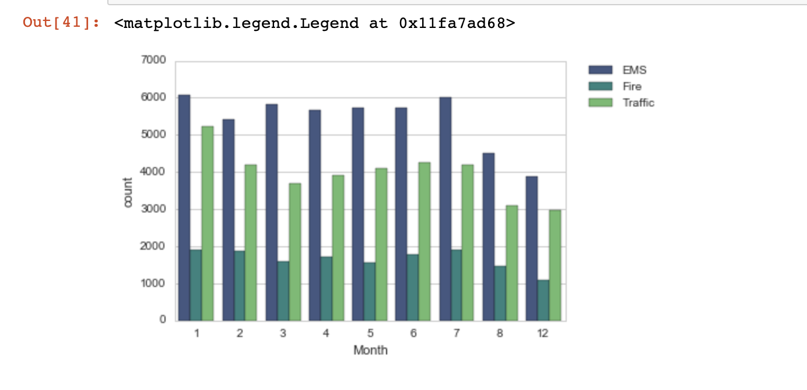

Then I took a step back and focused on each month between 2015 to 2020 to analyze trends. The bar chart above visualizes that EMS 911 calls occurred the most in January with just over 6,000 calls, and the least in December with around 3,900 calls. Similarly traffic 911 calls occur the most in January with around 5,200 calls, and the least calls fall in December with around 3000 calls. Fire 911 calls occur the most in January and July with around 1,900 calls, and the least in December. I'm not surprised that fire department 911 calls occur the most in July due to the weather/temperature as it is a peak month of summer where the weather can be hot and dry.

## Filling in the Missing Data

As you will notice, the above graph is missing data for a few months. I accounted for this by filling in information by creating a groupby object called byMonth, where I grouped the DataFrame by the month column and used the count() method for aggregation. I also leveraged seaborn's lmplot() to create a linear fit on the number of calls per month to determine is my plot is accurate. 

### My simple line plot that fills in the missing months:
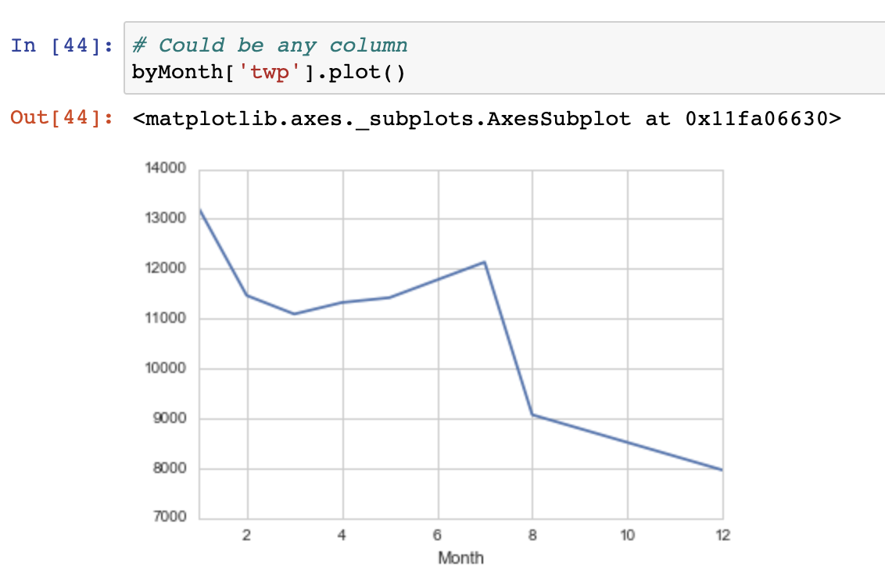

### Seaborn's lmplot()
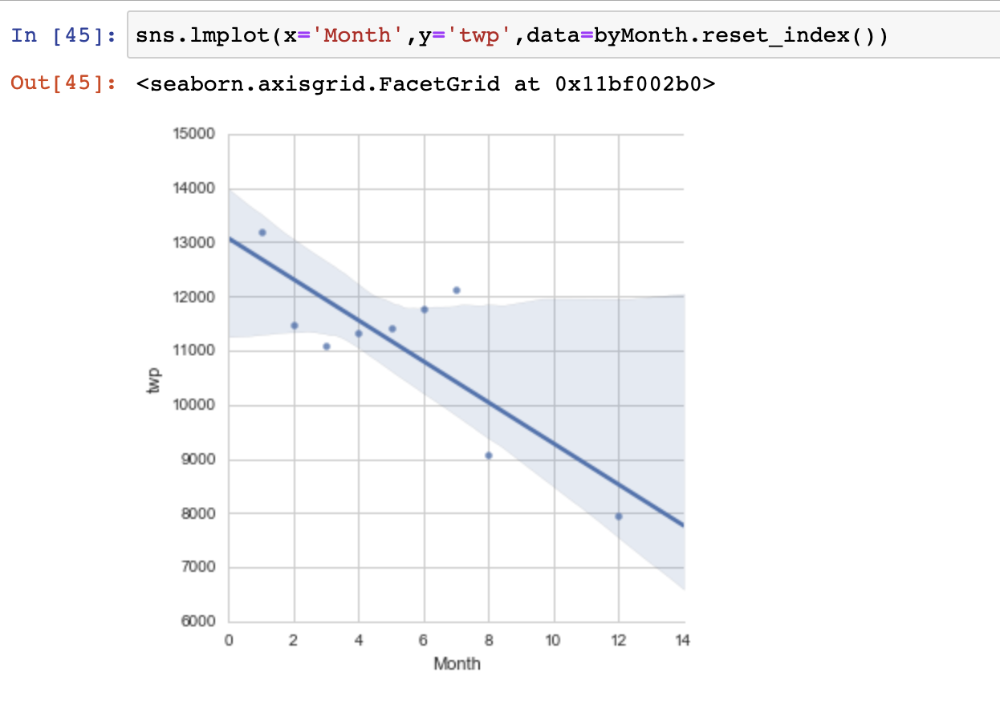

Ultimately my aggregation and Seaborn's lmplot() assume that September, October, and November is trending downwards for total 911 calls. With my methodology, September had around 8,750 calls, October had around 8,500 calls, and November had around 8,250 calls. Seaborn estimates that September was between 9,000 to 11,900 calls (likely 9,500 calls), October was between 8,500 to 11,990 calls (likely 9,250 calls), and November was between 8,000 to 11,990 calls (likely 9,000 calls). I believe both models are effective as Seaborn provides a more accurate range of calls, but my aggregated model is likely a more accurate representation of the total 911 calls.

### Heatmap Visualizations

Below is a heatmap breaking down the most and least popular hours of the day by days of the week for 911 calls over all. The most 911 calls occur in general between the hours of 7-17 regardless of the day of the week, which makes sense as these are the typical hours people are awake and going about their day:

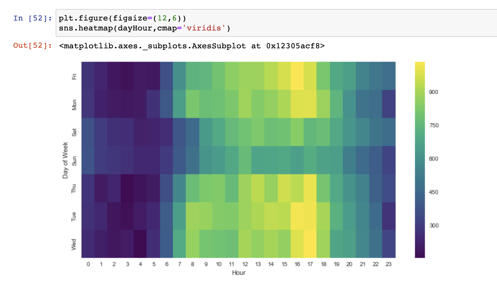

I reindexed the heatmap to be in order by most to least 911 calls by day. The visualization reveals that the most 911 calls occur on Tuesdays, while the least occur on Sunday:

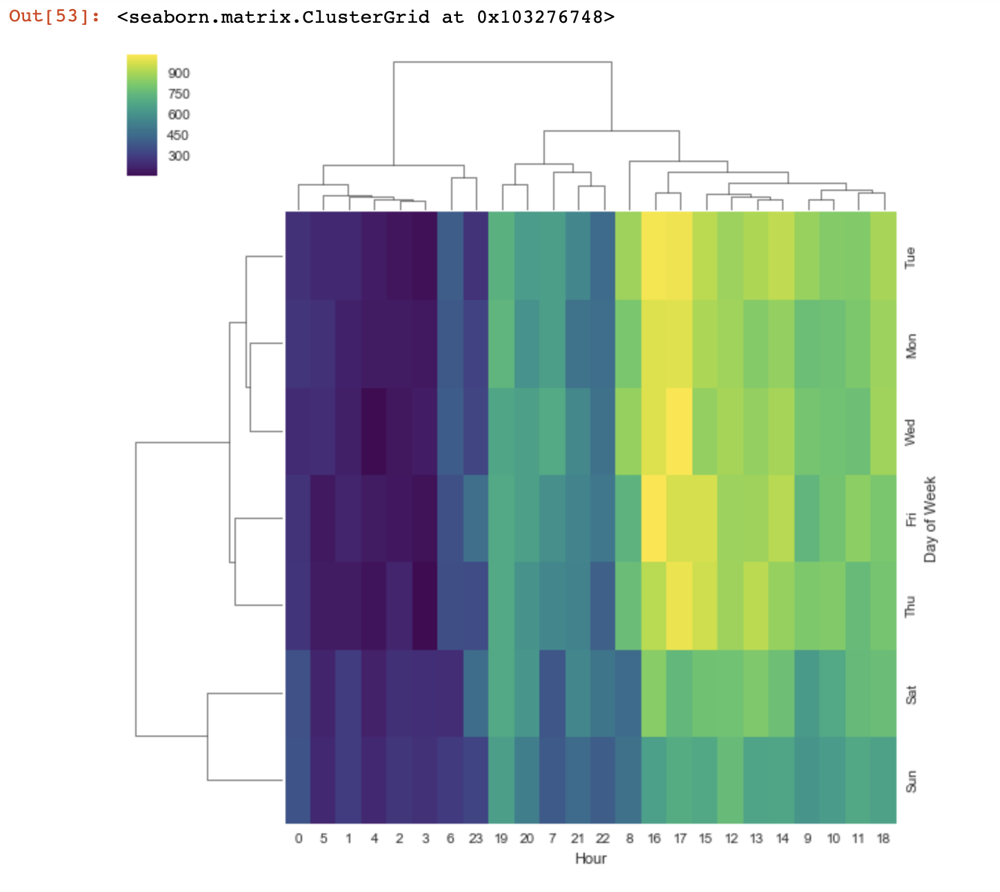

My final heatmap takes into account the most 911 calls by day of the week by month. The visualization reveals that August Saturdays have the least amount of 911 calls, while January Saturdays have the most 911 calls. Additionally December overall is the most peaceful month for all 911 responders:

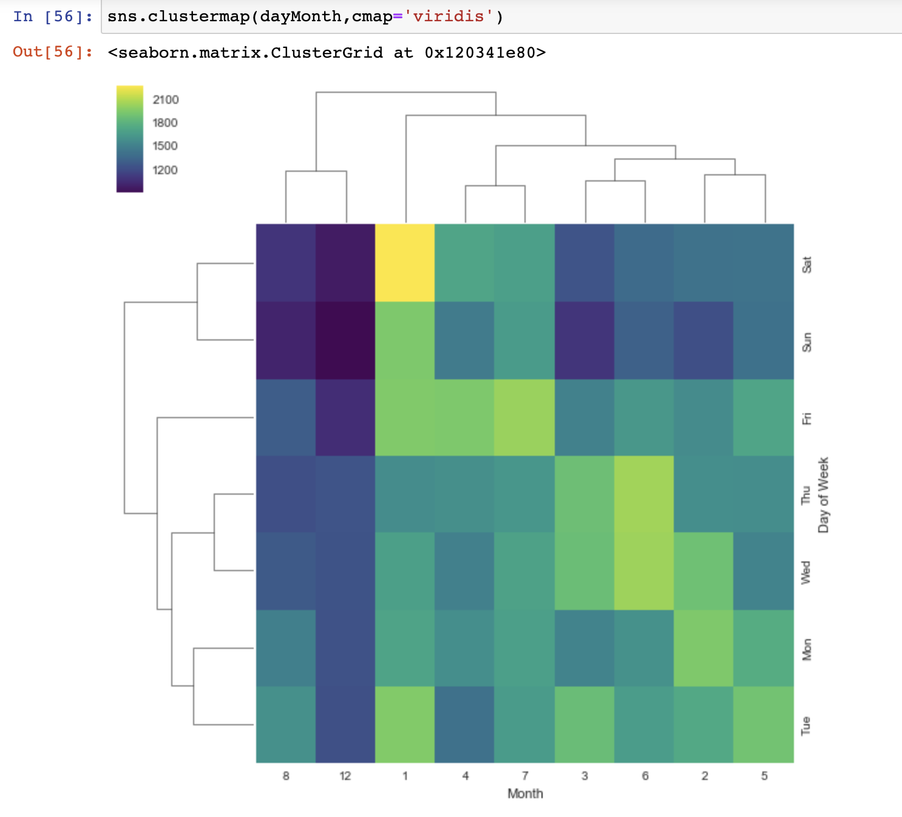

## Diving Deeper

### 2016 Aggregated 911 Calls Data

After observing the data at a high level by departement, and timestamp in general, I dove into the data provided for the year 2016 to see if I could find any interesting trends. Below is an image of the overall 911 call data from 2016:

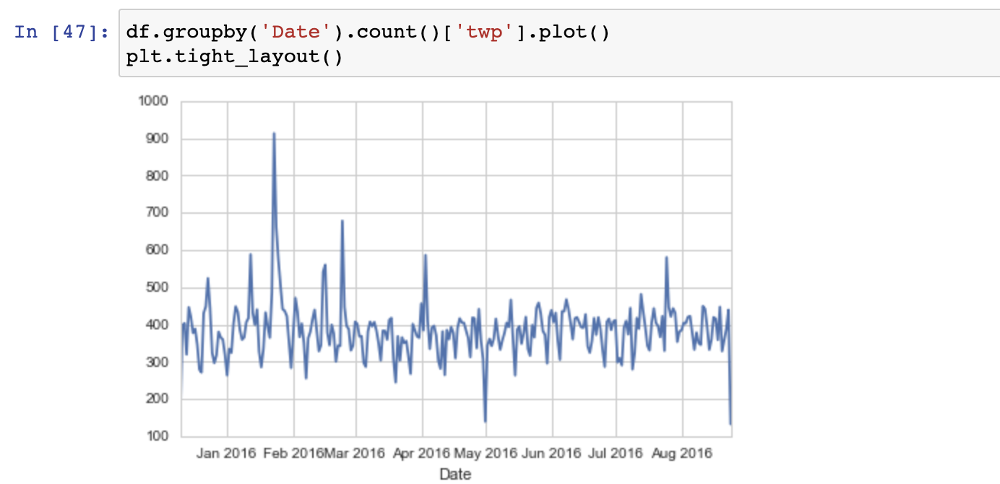

### 2016 Traffic Department 911 Calls
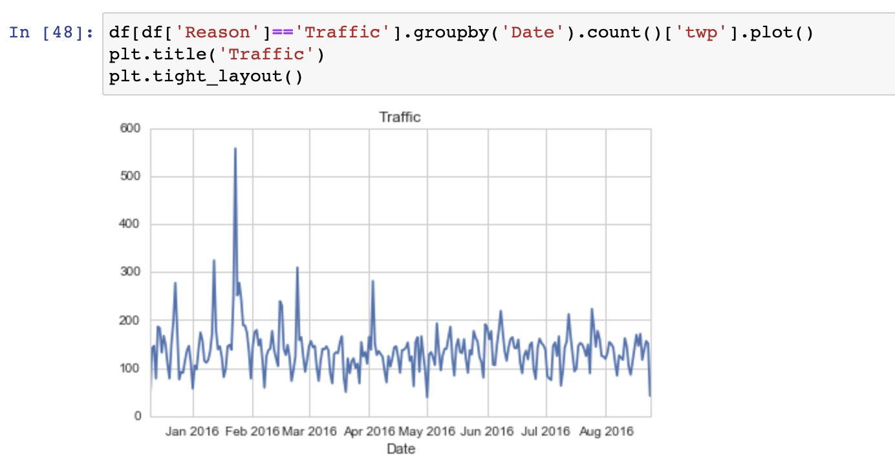

In 2016, I noticed that there were around 150 calls made to the traffic department each month. However, towards the end of January there is an outlier of around 550 calls made to the traffic department. The extra 400 calls were likely due to some catastrophic event on the highway, such as a horrific car accident. Furthermore the beginning of May had the fewest calls with around 50 calls made. I believe around May 1, 2016 was the safest day to drive on the highway, and around January 20 was the most dangerous day.

### 2016 Fire Department 911 Calls 
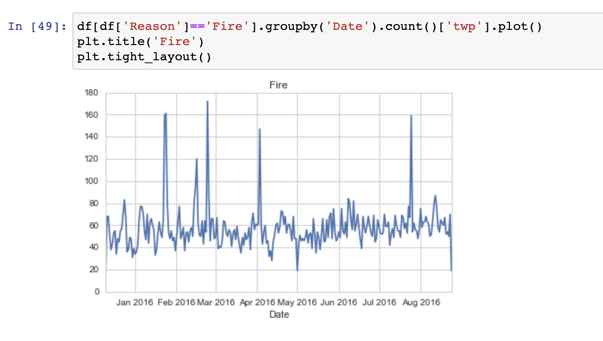

In 2016, I noticed that there were around 55 calls made to the fire department each month. However, there were a few outliers of around 160 calls made in mid-January, 120 calls made in the middle of February, 170 calls made toward the end of February (the 2016 fire department high of 911 calls in a day), 145 calls made in the beginning of April, and 160 calls made towards the end of July. The extra 100 or so calls were likely due to some catastrophic fire event, such as a house-fire or wildfire. Furthermore the beginning of May and October had the fewest calls with around 50 calls made. I believe that around May 1 and October 1 of 2016 were the safest days, and February was the most dangerous month in regards to fire safety hazards.

### 2016 EMS Department 911 Calls 
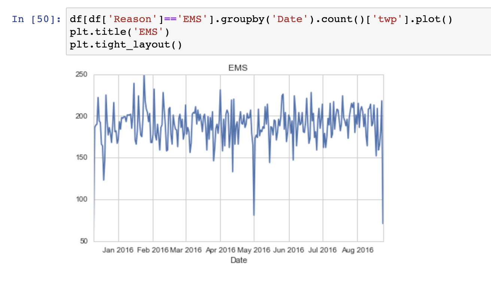

In 2016, I noticed that there were around 150 calls made to the ems department each month. Towards the end of January, there was an annual high of 250 calls in a day. The extra 100 calls was likely due to some catastrophic event. Furthermore the beginning of May had the fewest calls with around 75 calls made. 

## Conclusions
Ultimately if I was a citizen of the five townships in the dataset I would recommend living in Cheltenham or in the 19406 zip code as they have the least amount of 911 calls, and likely are safer. Regardless of your location, I recommend driving closer to the speed limit and following fire precautions tightly between January to March as there is a higher number of 911 calls for the traffic and fire departments over those months. Additionally I would be extra cautious on Saturdays in January, and anxiety-free Sundays in December (per the heatmaps). Finally I would be extra cautious transitioning into the new year as the amount of 911 calls increases by nearly 20% from December to January for all departments.
